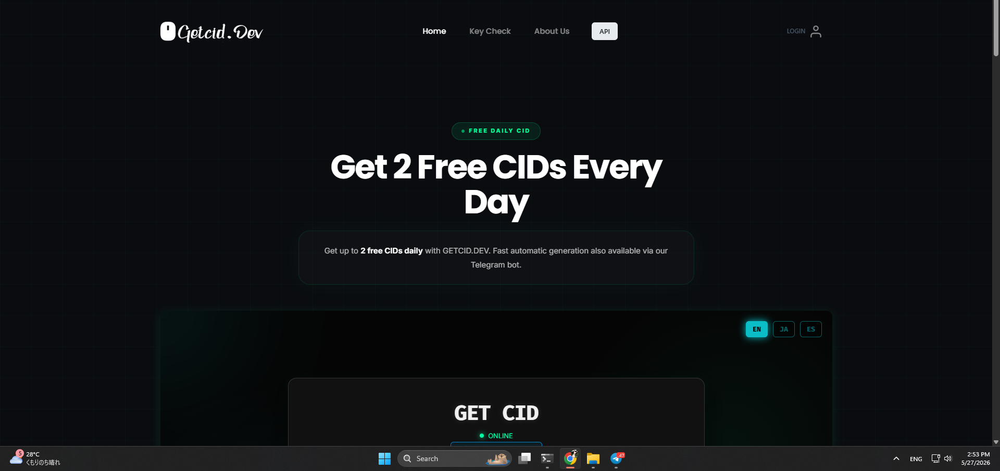
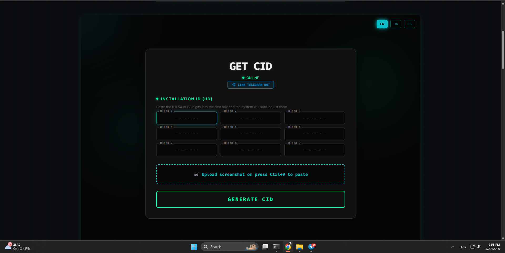
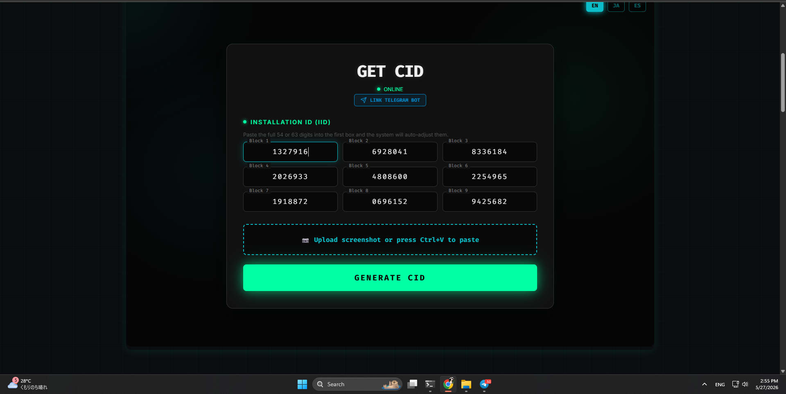
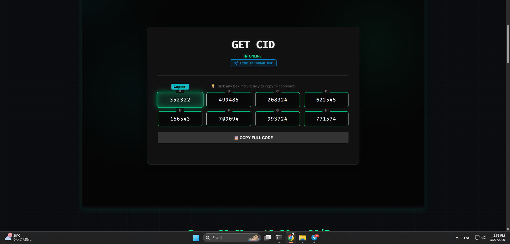
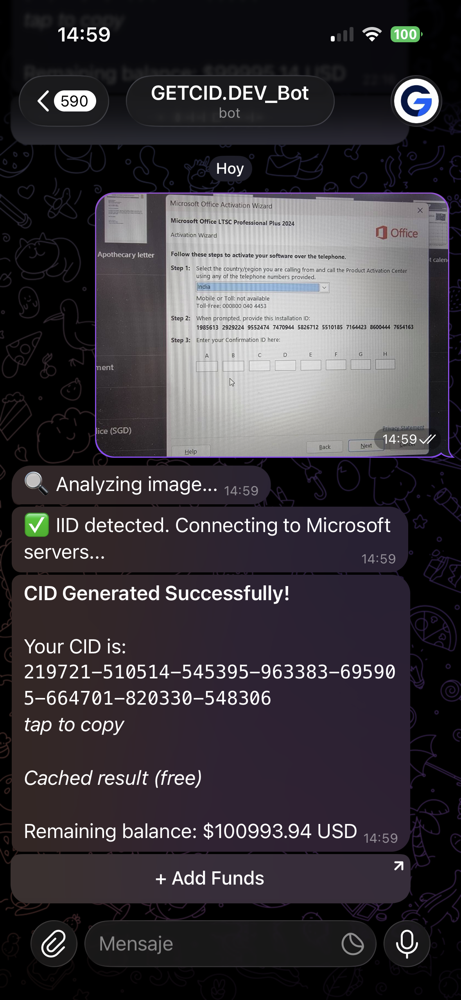

<div align="center">

# GetCID.Dev

**Windows Confirmation ID Generator — Fast, Automatic, Free to Try**

[](https://getcid.dev)
[](https://t.me/gedcidjp_bot)
[](https://getcid.dev)
[](https://getcid.dev)
[](https://getcid.dev/api/docs)

</div>

---

## 🇬🇧 English

### What is GetCID.Dev?

**GetCID.Dev** is a fast, automatic Windows Confirmation ID (CID) generator. If you need to activate Windows or Office by phone, you need a CID — we generate it instantly from your Installation ID (IID).

- No complicated steps
- Works for Windows 10, Windows 11, Office 2021, Office 2024 and more
- Available 24/7 via web and Telegram bot

---

### Why GetCID.Dev?

| | GetCID.Dev | Others |
|---|---|---|
| Price per CID | From **$0.02** | $0.10+ |
| Speed | Sub-second | Varies |
| Credits expiry | **Never expire** | Monthly/yearly |
| Support | **Direct admin contact** | Resellers/bots |
| API | Yes, v2.1 | Rarely |
| Free tier | 2 CIDs/day | None |

- **Lowest prices** — Bronze $0.04, Silver $0.03, Gold $0.02 per CID
- **Instant generation** — results in under a second
- **Credits never expire** — your balance stays forever
- **Direct admin support** — contact [@Hannya777jp](https://t.me/Hannya777jp) directly, no intermediaries
- **We are not resellers** — we own and operate our own infrastructure

---

### Free Tier

> **2 free CIDs per day** — no credit card required.

The free limit resets every 24 hours and works on both the website and Telegram bot.

---

### Screenshots

<div align="center">

**Landing Page**


**Enter your Installation ID**


**IID filled in — ready to generate**


**CID Generated — copy each block individually or all at once**


**Telegram Bot — send a screenshot and get your CID instantly**


</div>

---

### How to Use

**Web:**
1. Go to [getcid.dev](https://getcid.dev) and create an account
2. Paste your full IID (54 or 63 digits) into Block 1 — it auto-fills all blocks
3. Or upload a screenshot of your Activation Wizard
4. Click **Generate CID**
5. Copy your CID blocks A–H and enter them in the Activation Wizard

**Telegram Bot:**
1. Go to [getcid.dev](https://getcid.dev) and create an account
2. Click the **LINK TELEGRAM BOT** button in the GET CID tool — this links your web account to Telegram
3. Open [@gedcidjp_bot](https://t.me/gedcidjp_bot)
4. Send a screenshot of your Activation Wizard or type your IID
5. Receive your CID in seconds

---

### Pricing

| Plan | Price | Condition |
|---|---|---|
| Free | $0 | 2 CIDs/day |
| Bronze | $0.04/CID | Any recharge |
| Silver | $0.03/CID | Recharge $100+ |
| Gold | $0.02/CID | Recharge $200+ |

Credits **never expire**.

---

### API — Enterprise

> Full documentation: [getcid.dev/api/docs](https://getcid.dev/api/docs)

**GetCID Enterprise API v2.1** — High-fidelity CID generation infrastructure for professional Microsoft activation services. Sub-second latency. Zero configuration.

#### Onboarding

1. Create your account at [getcid.dev](https://getcid.dev)
2. Request your Master Token — contact [@Hannya777jp](https://t.me/Hannya777jp) on Telegram
3. Use your Master Token in every API request

#### Authentication

Every request must include your Master Token via the `x-api-key` HTTP header.

```
x-api-key: YOUR_MASTER_TOKEN
```

#### Generate CID

```
POST https://getcid.dev/api/generate
```

| Parameter | Type | Description |
|---|---|---|
| `iid` | string | Installation ID — 54 or 63 digits, no spaces or dashes |

**Python:**
```python
import requests
url = "https://getcid.dev/api/generate"
headers = {"x-api-key": "YOUR_MASTER_TOKEN"}
payload = {"iid": "63_DIGIT_INSTALLATION_ID"}
res = requests.post(url, json=payload, headers=headers)
print(res.json())
```

**cURL:**
```bash
curl -X POST "https://getcid.dev/api/generate" \
  -H "Content-Type: application/json" \
  -H "x-api-key: YOUR_MASTER_TOKEN" \
  -d '{"iid":"63_DIGIT_INSTALLATION_ID"}'
```

#### Balance Inquiry

```
GET https://getcid.dev/api/balance
```

```bash
curl -X GET "https://getcid.dev/api/balance" \
  -H "x-api-key: YOUR_MASTER_TOKEN"
```

#### Response Structure

**Generate — Success:**
```json
{
  "success": true,
  "cid": "492833174526831974528...",
  "balance": "99.80",
  "engine": "Turbo-Fetch v12"
}
```

**Balance — Success:**
```json
{
  "success": true,
  "owner": "YOUR_USERNAME",
  "balance": 99.80,
  "currency": "USD"
}
```

---

### Links

- Website: [https://getcid.dev](https://getcid.dev)
- Telegram Bot: [@gedcidjp_bot](https://t.me/gedcidjp_bot)
- API Docs: [https://getcid.dev/api/docs](https://getcid.dev/api/docs)
- How it works: [https://getcid.dev/#how](https://getcid.dev/#how)
- Pricing: [https://getcid.dev/#pricing](https://getcid.dev/#pricing)
- Contact / Support: [@Hannya777jp](https://t.me/Hannya777jp)

---

## 🇪🇸 Español

### ¿Qué es GetCID.Dev?

**GetCID.Dev** es un generador automático y rápido de Confirmation ID (CID) para Windows. Si necesitas activar Windows u Office por teléfono, necesitas un CID — nosotros lo generamos al instante desde tu Installation ID (IID).

---

### ¿Por qué GetCID.Dev?

| | GetCID.Dev | Otros |
|---|---|---|
| Precio por CID | Desde **$0.02** | $0.10+ |
| Velocidad | Sub-segundo | Variable |
| Expiración de créditos | **Nunca expiran** | Mensual/anual |
| Soporte | **Contacto directo con admin** | Revendedores/bots |
| API | Sí, v2.1 | Raramente |
| Plan gratuito | 2 CIDs/día | Ninguno |

- **Precios más bajos** — Bronze $0.04, Silver $0.03, Gold $0.02 por CID
- **Generación instantánea** — resultados en menos de un segundo
- **Los créditos nunca expiran** — tu saldo permanece para siempre
- **Soporte directo con el admin** — contacta a [@Hannya777jp](https://t.me/Hannya777jp) directamente, sin intermediarios
- **No somos revendedores** — somos dueños y operamos nuestra propia infraestructura

---

### Plan Gratuito

> **2 CIDs gratis por día** — sin tarjeta de crédito.

El límite gratuito se reinicia cada 24 horas y funciona en la web y el bot de Telegram.

---

### Cómo Usar

**Web:**
1. Ve a [getcid.dev](https://getcid.dev) y crea una cuenta
2. Pega tu IID completo (54 o 63 dígitos) en el Bloque 1 — se distribuye automáticamente
3. O sube un screenshot del Asistente de Activación
4. Haz clic en **Generate CID**
5. Copia los bloques A–H e ingrésalos en el Asistente de Activación

**Bot de Telegram:**
1. Ve a [getcid.dev](https://getcid.dev) y crea una cuenta
2. En la herramienta GET CID, haz clic en el botón **LINK TELEGRAM BOT** — esto vincula tu cuenta web con Telegram
3. Abre [@gedcidjp_bot](https://t.me/gedcidjp_bot)
4. Envía un screenshot del Asistente de Activación o escribe tu IID
5. Recibe tu CID en segundos

---

### Precios

| Plan | Precio | Condición |
|---|---|---|
| Free | $0 | 2 CIDs/día |
| Bronze | $0.04/CID | Cualquier recarga |
| Silver | $0.03/CID | Recarga $100+ |
| Gold | $0.02/CID | Recarga $200+ |

Los créditos **nunca expiran**.

---

### API — Enterprise

> Documentación completa: [getcid.dev/api/docs](https://getcid.dev/api/docs)

**GetCID Enterprise API v2.1** — Infraestructura de generación CID de alta fidelidad para servicios profesionales de activación Microsoft. Latencia sub-segundo. Cero configuración.

#### Onboarding

1. Crea tu cuenta en [getcid.dev](https://getcid.dev)
2. Solicita tu Master Token — contacta a [@Hannya777jp](https://t.me/Hannya777jp) en Telegram
3. Usa tu Master Token en cada request de la API

#### Autenticación

Cada request debe incluir tu Master Token via el header HTTP `x-api-key`.

```
x-api-key: YOUR_MASTER_TOKEN
```

#### Generar CID

```
POST https://getcid.dev/api/generate
```

| Parámetro | Tipo | Descripción |
|---|---|---|
| `iid` | string | Installation ID — 54 o 63 dígitos, sin espacios ni guiones |

**Python:**
```python
import requests
url = "https://getcid.dev/api/generate"
headers = {"x-api-key": "YOUR_MASTER_TOKEN"}
payload = {"iid": "63_DIGIT_INSTALLATION_ID"}
res = requests.post(url, json=payload, headers=headers)
print(res.json())
```

**cURL:**
```bash
curl -X POST "https://getcid.dev/api/generate" \
  -H "Content-Type: application/json" \
  -H "x-api-key: YOUR_MASTER_TOKEN" \
  -d '{"iid":"63_DIGIT_INSTALLATION_ID"}'
```

#### Consulta de Saldo

```
GET https://getcid.dev/api/balance
```

#### Estructura de Respuesta

**Generar — Éxito:**
```json
{
  "success": true,
  "cid": "492833174526831974528...",
  "balance": "99.80",
  "engine": "Turbo-Fetch v12"
}
```

---

### Enlaces

- Web: [https://getcid.dev](https://getcid.dev)
- Bot Telegram: [@gedcidjp_bot](https://t.me/gedcidjp_bot)
- Documentación API: [https://getcid.dev/api/docs](https://getcid.dev/api/docs)
- Cómo funciona: [https://getcid.dev/#how](https://getcid.dev/#how)
- Precios: [https://getcid.dev/#pricing](https://getcid.dev/#pricing)
- Contacto / Soporte: [@Hannya777jp](https://t.me/Hannya777jp)

---

<div align="center">

Made with ❤️ — [getcid.dev](https://getcid.dev)

</div>
